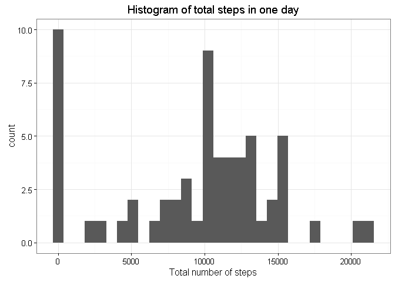
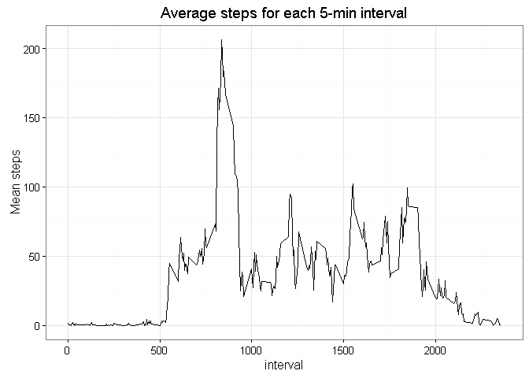
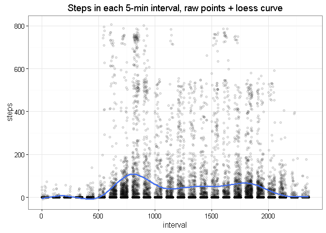
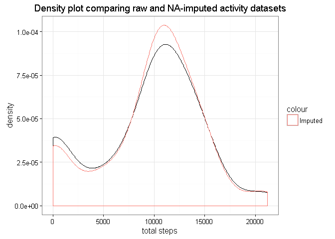
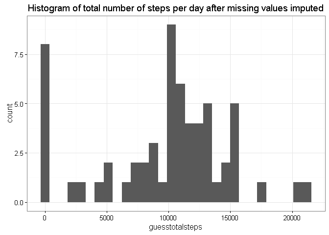
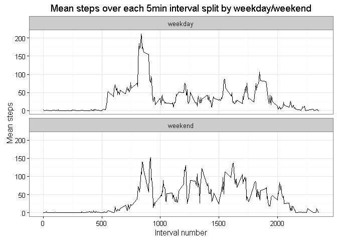

# Reproducible Research: Peer Assessment 1


```r
#Header code, setup required libraries
library(ggplot2)
```

```
## Warning: package 'ggplot2' was built under R version 3.2.5
```

```r
library(plyr)
```

```
## Warning: package 'plyr' was built under R version 3.2.5
```

## Loading and preprocessing the data

```r
#read in
activityVar<-read.csv("activity.csv",colClasses=c("integer","Date","integer"))
#q1
stepsperday<-ddply(activityVar, c("date"),summarise,
                   totalsteps=sum(steps,na.rm=TRUE)
                   )
#q2
stepsper5min<-ddply(activityVar, c("interval"),summarise,
                    meansteps = mean(steps,na.rm=TRUE)
                    )
```

## What is mean total number of steps taken per day?

The mean total number of steps taken per day is 9354.2295082.  The median number of steps taken per day is 10395(NA's omitted).


```r
stepshist<-ggplot(stepsperday,aes(x=totalsteps))+geom_histogram()+
  xlab("Total number of steps")+
  ggtitle("Histogram of total steps in one day")+
  theme_bw()
print(stepshist)
```

```
## `stat_bin()` using `bins = 30`. Pick better value with `binwidth`.
```



## What is the average daily activity pattern?

```r
dayline<-ggplot(stepsper5min,aes(x=interval,y=meansteps))+geom_line()+
  ggtitle("Average steps for each 5-min interval")+
  ylab("Mean steps")+
  theme_bw()
print(dayline)
```



Alternative daily activity pattern visualisation, raw points with a loess curve


```r
dayraw<-ggplot(activityVar,aes(x=interval,y=steps))+geom_point(alpha=.1)+geom_smooth()+
  ggtitle("Steps in each 5-min interval, raw points + loess curve")+
  theme_bw()
print(dayraw)
```

```
## Warning: Removed 2304 rows containing non-finite values (stat_smooth).
```

```
## Warning: Removed 2304 rows containing missing values (geom_point).
```



The five minute interval with the highest mean step-count is interval #835 with a mean of 206.1698113 steps.  

## Imputing missing values

There are 2304 incomplete records, unevenly distributed through the data.


```r
hist(which(complete.cases(activityVar)),
     main="Count of complete cases (chronological order)",
     xlab="Observation number",
     ylab="Count of complete cases"
     )
```


 
Interpolation is done by using the average of the previous valid observation and the next valid observation, or the average for the relevant 5-min interval if there is no valid previous/next observation. This produces smooth activity-over-the-day lines for each individual day, but is not very fast.
 

```r
#q3
step_interpolation <- function(rownumber){
  prevrow=rownumber;
  nextrow=rownumber;
  while(is.na(activityVar$steps[prevrow])){
    prevrow=prevrow-1
    if(prevrow<1)return(mean(activityVar[activityVar$interval==activityVar$interval[rownumber],"steps"],na.rm=TRUE))
  }
  while(is.na(activityVar$steps[nextrow])){
    nextrow=nextrow+1
    if(nextrow>nrow(activityVar))return(mean(activityVar[activityVar$interval==activityVar$interval[rownumber],"steps"],na.rm=TRUE))
  }
  return(
    (activityVar$steps[prevrow]+activityVar$steps[nextrow])/2
  )
}

activity_guessNA <-activityVar
for(n in 1:nrow(activityVar)){
  if(is.na(activityVar$steps[n])){
    activity_guessNA$steps[n]=step_interpolation(n);
  }
}
```

I know, this is a density plot not a histogram, but the meaning is the same and I didn't want to superimpose two histograms. The imputed dataset has (relatively) fewer zeros, the original data is peppered with lone zeros and the imputation strategy above just doesn't reproduce this pattern. Most of the imputed entries appear to have been added in the most commonly occuring range.


```r
stepsperday2<-merge(
  ddply(activity_guessNA, c("date"),summarise,
        guesstotalsteps=sum(steps,na.rm=TRUE)
  ),
  stepsperday,
  by="date"
)

guesscheck<-ggplot(stepsperday2,aes(x=totalsteps))+
  geom_density()+
  geom_density(aes(x=guesstotalsteps,color="Imputed"))+
  ggtitle("Density plot comparing raw and NA-imputed activity datasets")+
  xlab("total steps")+
  theme_bw()
print(guesscheck)
```



Here's the histogram for my fellow pedants:

```r
forpeoplewhoreallywanttoseeahistogram<-ggplot(stepsperday2,aes(x=guesstotalsteps))+
    geom_histogram()+
  ggtitle("Histogram of total number of steps per day after missing values imputed")+
    theme_bw()
print(forpeoplewhoreallywanttoseeahistogram)
```

```
## `stat_bin()` using `bins = 30`. Pick better value with `binwidth`.
```



The mean and median total steps are 9354.2295082 and 10395, for the NA-imputed data the mean and median are  9707.219301 and 1.0571\times 10^{4}. 

## Are there differences in activity patterns between weekdays and weekends?

Looks like activity is higher on the weekends, particularly in the middle of the day, although it is lower early in the morning just after waking.


```r
paindays= c("Monday","Tuesday","Wednesday","Thursday","Friday")

activity_guessNA$weekday<-as.factor(ifelse(weekdays(activity_guessNA$date)%in%paindays,"weekday","weekend"))

stepsperinterval.weekdaysplit<-ddply(activity_guessNA, c("interval","weekday"),summarise,
                    meansteps = mean(steps,na.rm=TRUE)
)

weekdayplot<-ggplot(stepsperinterval.weekdaysplit,aes(x=interval,y=meansteps))+
  facet_wrap(~weekday,nrow=2,ncol=1)+
  geom_line()+
  theme_bw()+
  ggtitle("Mean steps over each 5min interval split by weekday/weekend")+
  ylab("Mean steps")+
  xlab("Interval number")
print(weekdayplot)
```


